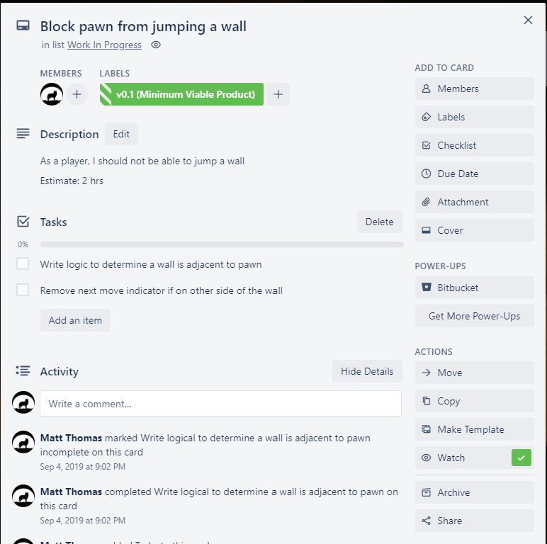

# Basic UI/UX Design #

## Designing your Web Application Interactions##

### User Experience (UX) ###

- Keep it INTUITIVE
  - Navigation should be obvious
- Make it  consistent
  - Follow the "standard" for interactions a.k.a clicking a hamburger icon should open the navigation and chevrons should open drawers.
  - Keep interactions the same across the application
- Allow users to make errors by handlers errors gracefully aka: form validation that asks the user to correct inputs that are not correct

Resources
  - [Fundamental Concepts UX](https://usabilla.com/blog/fundamental-concepts-ux/)
  - [5 key principles for new UX designers](https://careerfoundry.com/en/blog/ux-design/5-key-principles-for-new-ux-designers/)
  - [Insteraction Design Principles](https://www.mockplus.com/blog/post/interaction-design-principles)
  

## Design your Web Application Interface ##

### User Interface (UI) ###

#### Responsive Design or Mobile First layout ####
- Rearrange (stack) elements on narrow screens
- Hide/Show different elements based on screen size
- Adjust font sizes, bigger on smaller screens

Resources
- [Mobile First versus Responsive Web Design](https://darwindigital.com/mobile-first-versus-responsive-web-design/)
- [Mobile First is just not good enough meet journey driven design](https://www.smashingmagazine.com/2017/02/mobile-first-is-just-not-good-enough-meet-journey-driven-design/)

#### Fonts & Icons ####
- Find alternate fonts for logos and headers to make them stand out.
- Use icons only where appropriate.

Resources
- [Google Fonts](https://fonts.google.com/)
- [Material Icons](https://material.io/tools/icons)
- [Font Awesome](https://fontawesome.com/)

#### Images ####
- Due to copyright law, images need to be your own originals, or licensed Creative Commons or Public Domain

Resources
- [Pexels.com](https://www.pexels.com/)
- [Unsplash](https://unsplash.com/creative-commons-images)

#### Color & Contrast ####
- Pick a color palette and stick to it
- Keep accessibility in mind
  - Visually impaired & colorblind
  
Resources:
- [Coolors](https://coolors.co)
- [Paletton](http://paletton.com)
- [Colorspire](https://www.colorspire.com)

#### Navigation ####
- Again, it should be intuitive

#### Animations ####
- Only implement after your web app is fully functional
- Can be very time-consuming for little benefit

Resources
- [Intro to CSS Animations](https://css-tricks.com/video-screencasts/97-intro-to-css-animations/)

## Define your Timeline

### How much time do you have to complete your project? ###

- Estimate the amount of time you have on a daily/weekly basis
  - Example: Approximately 2 hours/day, 5 days/week for 4 weeks = 40 hours (this is an aggressive timeline)
- This number is used to estimate whether completion of the Capstone project can be done on time
- Plan to complete your capstone project including testing by the Demo Day practice, so you can fine tune & polish the application before Demo Day

## Create your Kanban Board

### Trello.com ###

1. If you don't already have one, create an account on trello.com
1. Create a new board
    1. Name the board something meaningful regarding your capstone project
1. Share your board with the Instructors and Teacher's Assistants
1. Create swin lanes which represent each step in the development process
    1. Backlog
        1. Brainstorming and story/bug writing
    1. Ready for development
        1. Story writing completed, full details and acceptance criteria
    1. In Progress
        1. Stories currently being worked (should be limited to 1 or 2)
    
## Create your Stories/Bugs

1. Create a card, could be classified as a story (new feature) or a bug (defect in the code)
    1. Steps to creating a card
        1. Add a title
            1. Should be a BRIEF description of the requested feature or defect
        1. Define "Definition of Done"
            1. Story
                1. "As a [persona], I [want to], [so that]..."
            1. Bug
                1. Describe how to reproduce the defect and what should be done to correct the issue.
        1. Prioritize
            1. HTML comes before CSS and JavaScript, then Backend API...
        1. Estimate
            1. In hours how long you expect it to complete
        1. MVP (Minimum Viable Product), Optional, Future
    
Stories are NOT tasks, they are the definition of a feature
- You should task out each story, such as write the HTML, CSS and JavaScript, which we will cover next

Resources
- [Atlassin Tutorial](https://www.atlassian.com/agile/project-management/user-stories)
- [How To Write User Stories by Robert Smith](https://www.youtube.com/watch?v=eYZ8vBXL1kk), [Part 2](https://www.youtube.com/watch?v=_iodOh-QTww)
- [Example of thought process for a simple task such as create a PBJ Sandwich](https://youtu.be/5X58UgQpGyQ)

## Task out your Stories/Bugs

1. Create a task list within your story/bug
    1. Use the Github checklist within the description section to add a list of tasks
        1. Define tasks required to fulfill the definition of done
        1. Prioritize the tasks and sort by priority
        1. Estimate/Time Box
            1. Keep in mind your total time line estimate from earlier
            1. For tasks you haven't done before, multiple by 1.5 or 2
            1. Time boxing, determine the max time to spend on an optional feature
                1. Once that time has elapsed, stop work and reevaluate if there is a better use of your time
    
Resource
- [Timebox](https://www.agilealliance.org/glossary/timebox)

### Example Story

## Develop your Web Application

#### THe FUN part

- Update your kanban board as you start and complete stories and tasks.
- You and others should be able to gauge your completeness by the board status.

## Test your Web Application

#### What you should be testing?

- Make sure it behaves correctly.
- Make sure it looks correct, at different window sizes
  
#### How should you test?

- Test as stories are completed 
- Test on many devices and resolutions
- Test in multiple web browsers
    - Chrome, Safari, Microsoft Edge, if suicidal Internet Explorer
- Have others test
    - You should observe them testing and listen to their feedback
    - Have teacher, mentors, peers, friend (smart & dumb), your kids, your parents
    
## HOMEWORK! - Update the Documentation from Project Planning

Document the entire process of design, development and testing.

- Reference your decisions when questions arise.
- The documentation will be included in your portfolio, so make it look nice.

Documentation should include:
- Your decisions
    - Selected fonts, icons, images and color scheme
- Your timeline
- Link to your Trello board
